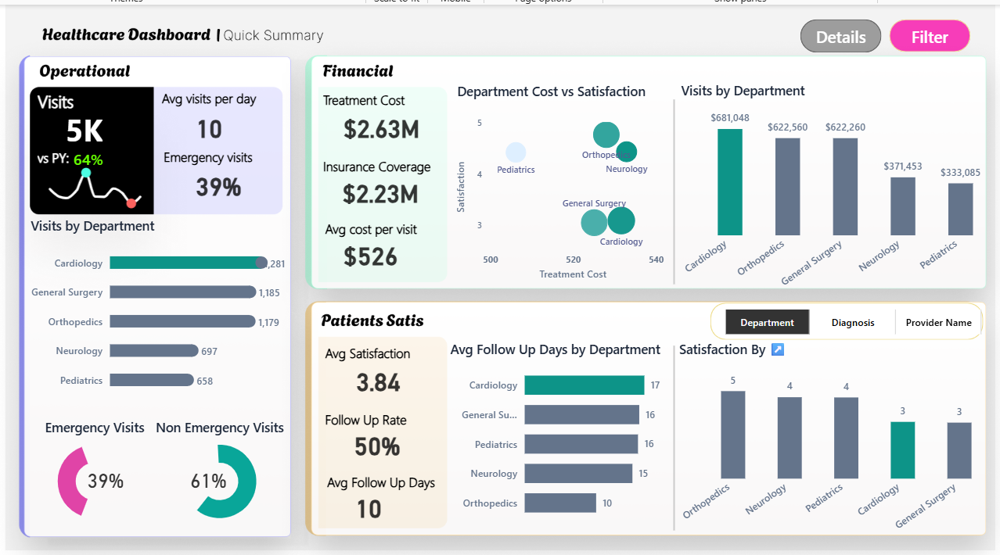

<div align="center">

# 🏥 Healthcare Analytics Dashboard


*An interactive Power BI dashboard designed to analyze healthcare data and provide actionable insights into patients, providers, visits, satisfaction, and follow-up performance.*

</div>

---

## 📸 Dashboard Preview


| Overview | Patient Details |
| :---: | :---: |
|  |  |


---

## 🚀 Project Overview

This project transforms raw healthcare data into an interactive, user-friendly analytical dashboard. It empowers hospital administrators and healthcare managers to track, understand, and optimize:

- 🧑‍🤝‍🧑 **Patient visit patterns** & demographic distribution
- ⭐ **Patient satisfaction** and feedback scores
- 📞 **Follow-up performance** and response times
- 👨‍⚕️ **Provider performance** across multiple specialties
- 📈 **Key healthcare KPIs** critical to operational success

---

## 🎯 Key KPIs Tracked

```diff
+ Total Patients
+ Total Visits
+ Average Satisfaction Score
+ Follow-up Rate (%)
+ Average Follow-up Days
+ Patient Visit Distribution
+ Provider Performance Metrics
📑 Dashboard Pages
1️⃣ Overview
Provides a high-level, executive view of the healthcare operation. It highlights primary KPIs, major trends over time, and overall system health at a glance.

2️⃣ Patients Details
Dives deep into the patient journey. It offers detailed insights into patient activity, visit history, satisfaction ratings, and follow-up behavioral patterns.


🛠️ Tools, Technologies & Features
Core Stack
Power BI: Primary visualization and dashboarding tool.

Power Query: Used for data extraction, cleaning, and transformation (ETL).

DAX: Applied for complex calculations, time-intelligence, and measure creation.

Advanced Power BI Features Implemented
Feature	Description
🎛️ Interactive Slicers	Allows users to slice data by date, provider, or patient demographics.
🔖 Bookmarks & Selection	Used to create seamless, app-like navigation and toggle visual states.
🧮 Field Parameters	Enables dynamic switching of metrics within the same visual.
🚦 Conditional Formatting	Highlights underperforming metrics in red and on-target metrics in green.
🔗 Data Modeling	A robust star-schema layout linking fact tables to relevant dimensions.
💡 Business Questions Answered
This dashboard was purpose-built to answer critical operational questions:

Diff
! How many total patients and visits are being handled in a given period?
! What is the overall patient satisfaction rate, and is it trending up or down?
! What percentage of patients receive a timely follow-up?
! How long does the average follow-up typically take?
! How are visits distributed across different care categories or departments?
! Which healthcare providers are consistently performing the best?
! What seasonal or cyclical patterns can be identified in patient activity?
📂 Project Structure
Plaintext
Healthcare-Analytics/
│
├── README.md                          # Project documentation
├── Data/                              # Raw and processed datasets
├── Dashboard/
│   └── Dashboard.pbix      # The core Power BI dashboard file
└── Screenshots/                       # Dashboard preview images
